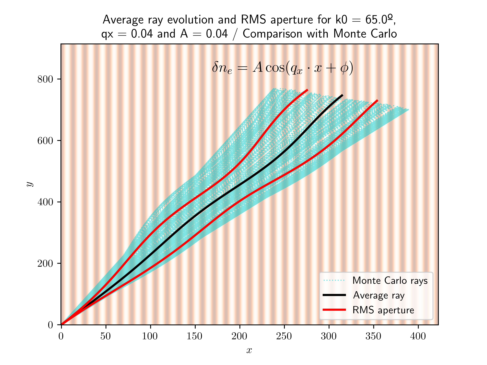

# WTRS - Weakly Turbulent Ray-tracing in Slab geometry
A ray tracing code in 2D - slab geometry based on the work of J.P. Bizarro, H. Hugon and R. Jorge, 2018 (https://journals.aps.org/pra/abstract/10.1103/PhysRevA.98.023847)

# Single-mode, homogeneous random media case: physical description

## Physical quantities (SI): 
- $r_1$, $r_2$ (2D - positions $[m]$)
- $k = ||k||$ (scalar wavevector $[m^{-1}]$)
- $k_1, k_2$ (2D - wavenumbers $[m^{-1}]$)
- $k_0$ (unperturbed wavenumber $[m^{-1}]$)
- $c$ (speed of light $[m.s^{-1}]$) 
- $q$ (wavenumber of turbulence $[m^{-1}]$
- $n_0$ (unperturbed refractive index)
- $n$ (refractive index)
- $< n_e >$ (ensemble averaged density $[m^{-3}]$)
- $\phi$ (random phase $[0, 2 \pi]$)
- $\delta n_e (r) = \delta n_{e_0} cos(q r_1 + \phi)$  (density fluctuations of $< ne > [m^{-3}]$)
- $n(r)/n0 = 1 + \delta n_e (r) / <ne>$ (turbulence profile through the effects of density fluctuations in the refractive index [adimensional])
- $t$ (time $[s]$)
- $w(r) = c k /n(r)$ (dispersion relation $[s^{-1}]$)

## Normalized quantites used in the code
- $x[y] = \frac{k_0}{2 \pi} r_{1[2]}$ (position)
- $\kappa_{x[y]} = \frac{k_{1[2]}}{k_0}$
- $\delta n_e (r) = \delta n_{e0} cos(q x + \phi)$
- $q -> q/k_0$ (in this normalized system, wavenumber of turbulence becomes adimensional)
- $\tau = (c k_0 / 2 \pi n_0) t$
- $< ne > === 1 -> $\delta n_{e0} (r)$ becomes a percentage 
- $\kappa_{x[y]_0}, x[y]_0$ refer to initial conditions for normalized wavevectors and position, respectively 

- Output example:

TODO:
- Seed random phases so the randomness doesn't get stuck: DONE
- Solve constructor issue/bug (randomly reassigning 'self' vars) : DONE ± (STILL NEED TO ADRESS)
- Review math (Monte Carlo and formalism equations) : DONE: solved major bugs
- Include info and logging (especially at the input handler)
- Include timer in the run() method
- Include possibility of plotting dxdx, dydy, dkxdkx, dkydky with Monte Carlo: DONE
- Include trajectory mode, in which the ray trajectory is depicted with the rms-spreading,
 and all the Monte Carlo Rays are plotted in this case (see paper): DONE
- Refactor output locations and naming
- Refactor plot title, font, etc. according to the input: DONE
- Raise error when input has non-valid MC parameters: DONE
- Plot 1-mode turbulent background: DONE
- Include turbulence eq. in the trajectory figure: DONE
- Refactor visualizer code... its a bit amateur... (last priority)
